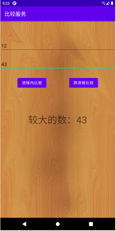
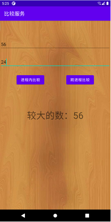

# CompareService
实验要求使用Service，提供比较两个整数大小的功能，提供Int Compare(Int, Int)函数，输入两个整数，输出较大的整数。具体要求如下：（1）实现进程内的服务；（2）使用AIDL语言，实现相同功能的跨进程服务；（3）设计用户界面，在界面上允许用户输入两个整数，并分别通过调用进程内和跨进程服务，将较大的数字显示在界面上。界面匹配背景图自选。

